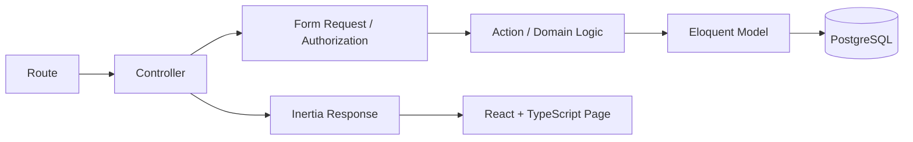
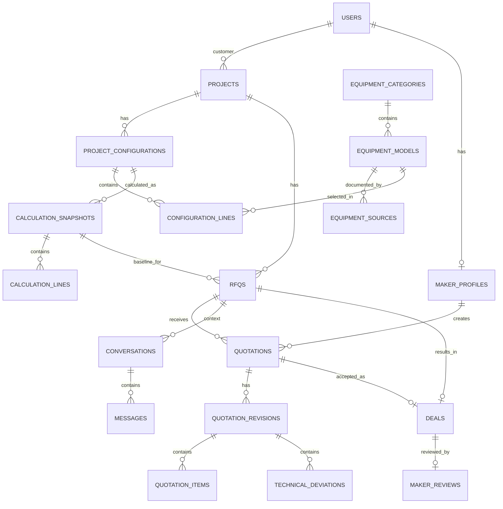

<div align="center">

# ARUSANTARA

### Preliminary engineering untuk kebutuhan peralatan usaha

**Submission for ITECHNO CUP 2026 - Web Development**  
**By Bit By Bit**

</div>

> **Status tautan:** source yang diaudit belum memiliki Git remote dan belum menyimpan URL live demo. Tautan repository dan deployment dapat ditambahkan setelah proses publish selesai.

---

## Daftar Isi

- [Tentang Proyek](#tentang-proyek)
- [Fitur Utama](#fitur-utama)
- [Demo dan Screenshot](#demo-dan-screenshot)
- [Teknologi](#teknologi)
- [Arsitektur Sistem](#arsitektur-sistem)
- [Instalasi dan Setup](#instalasi-dan-setup)
- [Penggunaan](#penggunaan)
- [Route dan Integrasi Aplikasi](#route-dan-integrasi-aplikasi)
- [Testing dan Quality Check](#testing-dan-quality-check)
- [Tim Developer](#tim-developer)
- [Lisensi](#lisensi)

---

## Tentang Proyek

### Latar Belakang

Pemilik usaha biasanya lebih mengenal peralatan yang dipakai daripada parameter kelistrikannya. Di sisi lain, panel maker membutuhkan data teknis yang cukup jelas sebelum menyusun penawaran. Jika data yang belum diketahui langsung diganti dengan angka perkiraan, hasil awal bisa terlihat lengkap tetapi sulit dipertanggungjawabkan.

ARUSANTARA dibuat untuk menjaga alur tersebut tetap jelas: pengguna memasukkan konteks usaha dan equipment yang diketahui, sistem menyimpan konfigurasi, menjalankan preliminary engineering berdasarkan data yang tersedia, lalu membawa hasilnya ke proses RFQ dan quotation.

### Solusi yang Ditawarkan

ARUSANTARA menghubungkan tiga tahap dalam satu alur kerja:

1. **Project dan equipment** - customer membuat project, memilih equipment, jumlah, status existing/planned, dan pola penggunaan.
2. **Preliminary engineering** - konfigurasi dikunci, dihitung oleh Engineering Engine V1, lalu disimpan sebagai calculation snapshot.
3. **Technical procurement** - snapshot engineering menjadi acuan RFQ, quotation, technical deviation, revision, sampai acceptance dan deal.

Prinsip utamanya sederhana: data yang belum tersedia tidak diisi dengan angka buatan. Parameter tersebut tetap ditandai untuk verifikasi.

### Tujuan Proyek

- **Tujuan utama:** membantu customer menyiapkan technical baseline awal dari kebutuhan equipment sebelum masuk ke proses penawaran panel/engineering.
- **Target pengguna:** pemilik usaha/customer dan panel maker.
- **Nilai utama:** konfigurasi, hasil engineering, dan proses procurement tetap terhubung ke snapshot yang dapat ditelusuri.

### Batas Engineering V1

Engineering Engine V1 menghitung connected load, design load, design current jika input yang dibutuhkan tersedia, serta preliminary supply recommendation. Engine tidak ditujukan untuk menentukan final breaker, final protection, cable sizing, short-circuit study, breaking capacity, earthing, voltage drop final, protection coordination, atau final panel design.

---

## Fitur Utama

| Fitur | Fungsi | Catatan |
|---|---|---|
| **Project & Equipment Configuration** | Membuat project dan menyusun daftar equipment yang digunakan atau direncanakan. | Konfigurasi menyimpan quantity, equipment status, dan usage profile. |
| **Equipment Catalog** | Menyimpan model equipment beserta data kelistrikan dan sumber spesifikasi. | Dataset Laundry saat ini memuat model Electrolux Professional yang bersumber dari product data sheet resmi. |
| **Preliminary Engineering Engine V1** | Menghitung connected load, design load, design current bila input lengkap, dan preliminary supply. | Parameter yang tidak cukup tetap menjadi `requires_verification`. |
| **Calculation Snapshot** | Menyimpan hasil calculation per versi beserta input hash, warnings, assumptions, dan calculation lines. | Hasil lama tidak bergantung pada perubahan catalog setelah snapshot dibuat. |
| **Engineering Result** | Menampilkan hasil dalam Simple View dan Technical View. | Simple View untuk customer, Technical View untuk kebutuhan teknis dan traceability. |
| **RFQ** | Membuat request for quotation dari calculation snapshot yang sudah final. | RFQ tetap terikat ke technical baseline yang digunakan saat dibuat. |
| **Maker Quotation** | Panel maker membuat quotation draft, line items, biaya, lead time, warranty, dan revision. | Quotation mengikuti lifecycle draft, submitted, negotiating, accepted/rejected/withdrawn. |
| **Technical Deviation** | Mencatat perbedaan antara baseline yang diminta dan spesifikasi yang ditawarkan maker. | Menyimpan requested specification, proposed specification, alasan, price impact, dan lead-time impact. |
| **Quotation Negotiation & Deal** | Customer dapat membahas deviation, menerima/reject deviation, dan menerima quotation revision. | Deal terbentuk dari quotation revision yang valid. |
| **Authentication & Role** | Registrasi/login customer, email verification, password reset, Google OAuth, serta role customer/maker/admin. | Maker memakai `MakerProfile`; authorization tetap diperiksa di server. |

### Fitur Pendukung

- Profile, security, password update, dan appearance settings.
- Domain messaging dengan conversation dan message yang terikat ke konteks RFQ/quotation.
- Domain education article.
- Maker review yang terhubung ke deal.
- `DemoSeeder` untuk skenario demo customer, maker, project, engineering snapshot, RFQ, dan quotation.
- Health endpoint Laravel di `/up`.

---

## Demo dan Screenshot

### Live Demo

Belum dipublikasikan pada source yang diaudit. URL deployment dapat dimasukkan setelah aplikasi selesai dideploy.

### Repository GitHub

Git remote belum dikonfigurasi pada source yang diaudit. README ini dapat langsung dipakai setelah repository ARUSANTARA dibuat di GitHub.

### Screenshot

Screenshot final sebaiknya diambil dari build yang sudah dipakai untuk submission. Source yang diaudit tidak memiliki folder screenshot final untuk README.

Screenshot yang disarankan untuk submission:

1. Dashboard / My Projects.
2. Customer Configurator.
3. Engineering Result - Simple View.
4. Engineering Result - Technical View.
5. RFQ customer.
6. Quotation dan Technical Deviation maker.

### Video Demo

Belum ada link video demo di repository.

---

## Teknologi

### Tech Stack

#### Frontend

```text
UI / Rendering : React 19.2 + Inertia React 3
Language       : TypeScript 5.7
Styling        : Tailwind CSS 4
UI primitives  : Radix UI
Icons          : Lucide React
Bundler        : Vite 8
Routing helper : Laravel Wayfinder
```

#### Backend

```text
Runtime        : PHP 8.4.1+
Framework      : Laravel 13
ORM            : Eloquent ORM
Database       : PostgreSQL
Authentication : Laravel Fortify
OAuth          : Laravel Socialite (Google)
Session        : Database
Cache          : Database
Queue          : Database
```

#### Quality dan Development Tools

```text
Backend tests  : Pest / PHPUnit
Static analysis: PHPStan + Larastan
PHP formatting : Laravel Pint
Frontend lint  : ESLint
Formatting     : Prettier
Type checking  : TypeScript compiler
Dependency bot : GitHub Dependabot
```

### Alasan Pemilihan Teknologi

| Teknologi | Alasan |
|---|---|
| **Laravel + Eloquent** | Cocok untuk domain yang memiliki banyak relasi, transaction boundary, status lifecycle, dan integrity rule. |
| **Inertia + React** | Memberikan pengalaman React tanpa memisahkan aplikasi menjadi backend API dan frontend SPA yang berbeda. |
| **PostgreSQL** | Mendukung relational integrity, foreign key, transaction, enum/status data, dan snapshot yang dibutuhkan workflow engineering-procurement. |
| **TypeScript** | Membantu menjaga kontrak data pada halaman Inertia dan komponen frontend. |
| **Pest + Larastan + ESLint** | Menjaga behavior domain, static analysis PHP, dan konsistensi kode frontend. |

### Dependencies Utama

Backend utama dari `composer.json`:

```text
laravel/framework           ^13.17
inertiajs/inertia-laravel   ^3.0
laravel/fortify             ^1.37.2
laravel/socialite           ^5.31
laravel/wayfinder           ^0.1.14
pestphp/pest                ^5.1 (dev)
larastan/larastan           ^3.9 (dev)
```

Frontend utama dari `package.json`:

```text
react                       ^19.2.0
react-dom                   ^19.2.0
@inertiajs/react            ^3.0.0
tailwindcss                 ^4.0.0
typescript                  ^5.7.2
vite                        ^8.0.0
lucide-react                ^0.475.0
```

---

## Arsitektur Sistem

ARUSANTARA menggunakan **modular monolith**. Business logic tetap berada di backend, sedangkan React digunakan untuk presentation layer melalui Inertia.

### Alur Aplikasi



### Modul

```text
Identity
Equipment
Configuration
Engineering
Procurement
Messaging
Education
Trust
```

### Alur Utama Customer sampai Deal

```mermaid
flowchart LR
    A[Project] --> B[Equipment Configuration]
    B --> C[Lock Configuration]
    C --> D[Engineering Engine V1]
    D --> E[Calculation Snapshot]
    E --> F[RFQ]
    F --> G[Quotation]
    G --> H[Technical Deviation]
    H --> I[Quotation Revision]
    I --> J[Customer Acceptance]
    J --> K[Deal]
```



### Snapshot Engineering

```text
Configuration
  -> capture canonical input
  -> PreliminaryEngineeringEngine
  -> CalculationSnapshot
  -> CalculationLine(s)
  -> finalized snapshot
  -> RFQ technical baseline
```

Snapshot menyimpan calculation version, input hash, connected load, design load, design current, supply recommendation, status, assumptions, warnings, dan line detail.

### Database Schema Ringkas



### Struktur Folder

```text
arusantara/
├── app/
│   ├── Actions/
│   │   ├── Engineering/
│   │   ├── Fortify/
│   │   ├── Identity/
│   │   ├── Messaging/
│   │   ├── Procurement/
│   │   └── Trust/
│   ├── Engineering/
│   ├── Equipment/
│   ├── Configuration/
│   ├── Procurement/
│   ├── Models/
│   └── Http/
├── database/
│   ├── migrations/
│   ├── factories/
│   └── seeders/
├── resources/js/
│   ├── components/
│   ├── layouts/
│   ├── pages/
│   ├── hooks/
│   ├── types/
│   └── routes/        # generated Wayfinder routes
├── routes/
│   ├── web.php
│   ├── settings.php
│   └── google-auth.php
├── tests/
│   ├── Feature/
│   └── Unit/
├── composer.json
├── package.json
└── vite.config.ts
```

---

## Instalasi dan Setup

### Prerequisites

Pastikan tersedia:

- PHP **8.4.1** atau lebih baru.
- Composer 2.
- Node.js **22.12.0** atau lebih baru.
- npm.
- PostgreSQL.
- Git.

### 1. Clone Repository

Setelah repository ARUSANTARA dipublikasikan di GitHub, clone melalui URL repository tersebut, lalu masuk ke folder project:

```bash
cd arusantara
```

### 2. Install Dependency Backend

```bash
composer install
```

### 3. Setup Environment

```bash
cp .env.example .env
php artisan key:generate
```

Konfigurasi PostgreSQL pada `.env`:

```env
DB_CONNECTION=pgsql
DB_HOST=127.0.0.1
DB_PORT=5432
DB_DATABASE=arusantara
DB_USERNAME=postgres
DB_PASSWORD=
```

Jika Google OAuth digunakan, isi:

```env
GOOGLE_CLIENT_ID=
GOOGLE_CLIENT_SECRET=
GOOGLE_REDIRECT_URI=
```

Jangan commit file `.env` ke repository.

### 4. Setup Database

```bash
php artisan migrate
php artisan db:seed --class=EquipmentCatalogSeeder
```

Untuk data demo:

```bash
php artisan db:seed --class=DemoSeeder
```

Jangan gunakan `migrate:fresh` pada database yang berisi data yang masih diperlukan.

### 5. Install Dependency Frontend

```bash
npm ci
```

### 6. Jalankan Development Server

Terminal pertama:

```bash
php artisan serve
```

Terminal kedua:

```bash
npm run dev
```

Jika queue diperlukan:

```bash
php artisan queue:listen --tries=1 --timeout=0
```

### 7. Production Build

```bash
npm run build
php artisan migrate --force
php artisan optimize
```

Deployment provider belum dikonfigurasi di source yang diaudit, jadi environment variable, web root, worker, dan database production perlu disesuaikan dengan platform deployment yang dipilih.

---

## Penggunaan

### Customer

1. Register/login dan selesaikan email verification.
2. Buka **My Projects** dan buat project baru.
3. Pilih business category. Dataset yang saat ini disiapkan untuk configurator adalah **Laundry**.
4. Pilih equipment model, quantity, status existing/planned, dan pola simultaneous use.
5. Jalankan engineering. Sistem mengunci configuration dan membuat calculation snapshot.
6. Buka **Engineering Result** untuk melihat connected load, design load, design current jika tersedia, preliminary supply, warning, dan parameter yang masih perlu verifikasi.
7. Buat RFQ dari snapshot engineering.
8. Publish RFQ dan review quotation yang masuk.
9. Tanggapi technical deviation jika maker mengajukan perubahan spesifikasi.
10. Terima quotation revision yang sudah sesuai untuk membentuk deal.

### Maker

1. Login menggunakan akun maker yang memiliki MakerProfile aktif.
2. Buka daftar RFQ yang tersedia.
3. Baca project dan technical baseline dari calculation snapshot.
4. Buat quotation draft.
5. Isi quotation items, biaya, lead time, warranty, dan catatan.
6. Jika ada perubahan dari baseline, tambahkan technical deviation beserta alasan dan dampaknya.
7. Submit quotation.
8. Jika negotiation berlanjut, buat quotation revision dan submit kembali.

### Engineering Result

Engineering Result memiliki dua presentation level:

- **Simple View:** ringkasan untuk customer.
- **Technical View:** snapshot, load schedule, assumptions, warnings, input hash, dan calculation detail untuk kebutuhan teknis/traceability.

---

## Route dan Integrasi Aplikasi

ARUSANTARA tidak menggunakan public REST API sebagai lapisan utama. Frontend React menerima data dari Laravel melalui Inertia, sehingga route web, controller, action, dan model berada dalam aplikasi yang sama.

### Route Utama Customer

| Method | Route | Fungsi |
|---|---|---|
| GET | `/projects` | Daftar project customer. |
| GET | `/projects/create` | Form project baru. |
| POST | `/projects` | Membuat project dan configuration V1. |
| GET | `/projects/{project}/configuration` | Customer configurator. |
| PUT | `/projects/{project}/configuration` | Menyimpan equipment configuration. |
| POST | `/projects/{project}/calculate` | Mengunci configuration dan menjalankan Engineering Engine. |
| GET | `/projects/{project}/engineering` | Engineering Result. |
| GET | `/projects/{project}/rfq/create` | Form RFQ dari finalized snapshot. |
| POST | `/projects/{project}/rfqs` | Membuat RFQ. |
| GET | `/rfqs/{rfq}` | Detail RFQ customer. |
| POST | `/rfqs/{rfq}/publish` | Publish RFQ. |
| GET | `/quotations/{quotation}` | Review quotation. |
| POST | `/quotations/{quotation}/deviations/{technicalDeviation}/respond` | Accept/reject technical deviation. |
| POST | `/quotations/{quotation}/discuss` | Memulai/lanjut negotiation. |
| POST | `/quotations/{quotation}/accept` | Menerima quotation revision. |

### Route Utama Maker

| Method | Route | Fungsi |
|---|---|---|
| GET | `/maker/rfqs` | Daftar RFQ yang dapat dilihat maker. |
| GET | `/maker/rfqs/{rfq}` | Detail RFQ dan technical baseline. |
| POST | `/maker/rfqs/{rfq}/quotation` | Membuat quotation draft. |
| GET | `/maker/quotations/{quotation}/edit` | Editor quotation. |
| PUT | `/maker/quotations/{quotation}` | Menyimpan quotation draft. |
| POST | `/maker/quotations/{quotation}/revisions` | Membuat revision draft. |
| POST | `/maker/quotations/{quotation}/submit` | Submit quotation/revision. |

### Authentication

Authentication menggunakan Laravel Fortify dengan route login, register, reset password, email verification, dan password confirmation. Google OAuth tersedia melalui:

```text
GET /auth/google
GET /auth/google/callback
```

---

## Testing dan Quality Check

Repository memiliki unit dan feature test untuk authentication, configuration, engineering, equipment, procurement, messaging, trust, settings, dan demo seeder.

### Backend Test

```bash
php artisan test
```

### PHP Formatting dan Static Analysis

```bash
composer run lint:check
composer run types:check
```

### Frontend Check

```bash
npm run format:check
npm run lint:check
npm run types:check
npm run build
```

### Quality Gate yang Dipakai Saat Pengembangan

```bash
php artisan test
composer run types:check
composer run lint:check
npm run lint:check
npm run types:check
npm run build
git status
```

Persentase code coverage belum dikonfigurasi pada repository yang diaudit, sehingga README ini tidak mencantumkan angka coverage yang tidak tersedia.

---

## Tim Developer

Git history pada source yang diaudit menggunakan author:

| Nama / Identitas Git | Peran | GitHub |
|---|---|---|
| **Bit By Bit** | Pengembangan ARUSANTARA | Remote GitHub belum dikonfigurasi pada source yang diaudit |

Nama anggota tim dan username GitHub individual tidak tersimpan di repository, sehingga tidak ditambahkan secara asumsi.

---

## Lisensi

`composer.json` mendeklarasikan project dengan lisensi **MIT**. Namun, file `LICENSE` belum ditemukan di root source yang diaudit. Jika project akan dirilis sebagai MIT, tambahkan file LICENSE sebelum repository dipublikasikan.

---

<div align="center">

**ARUSANTARA - ITECHNO CUP 2026**

</div>
